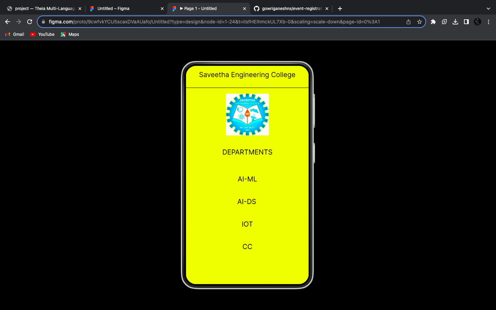
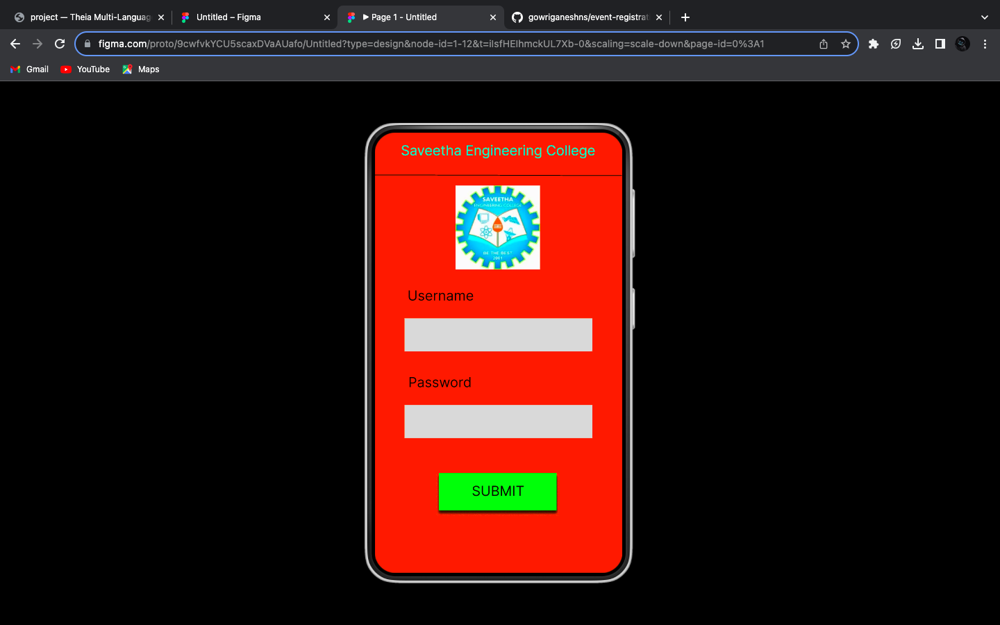
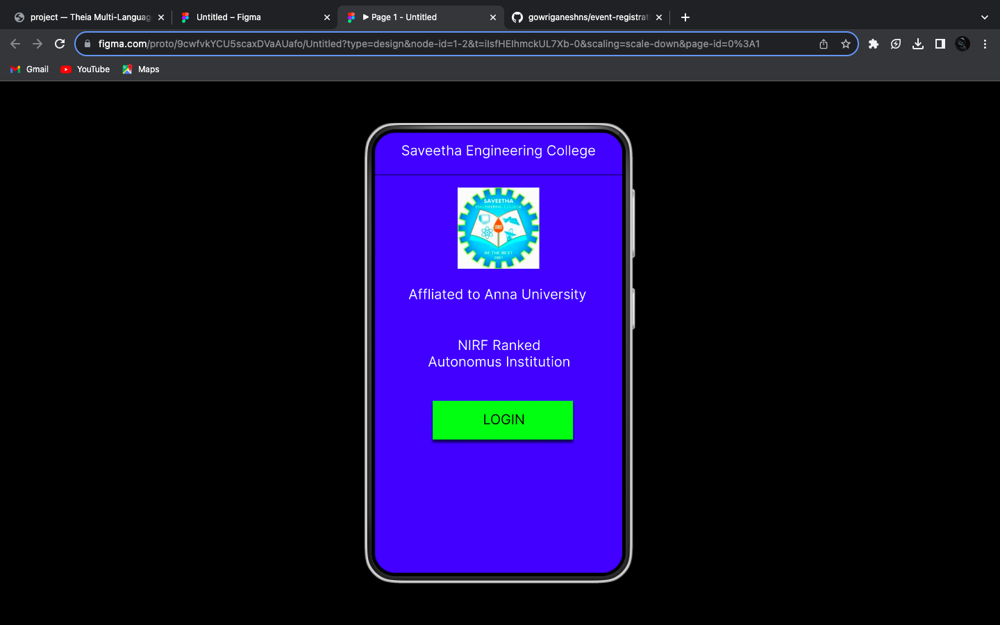

# Event Registration Web Application

## AIM:
To design, develop and deploy a web application for event registration.

## DESIGN STEPS:

### Step 1:
Create a new frame.

### Step 2:
Select any one preset size of your choice.

### Step 3:
Select the shapes you need.

### Step 4:
Import images as needed.

### Step 5:
Create pages based on your need and link them.

### Step 6:
Validate the HTML and CSS code.

### Step 7:
Publish the website in the given URL.

## DESIGN TOOL:
Figma

## CODE:
```
/* Home Page */

position: relative;
width: 360px;
height: 640px;
background: #031CFF;

/* Saveetha Engineering College */

position: absolute;
width: 333px;
height: 48px;
left: 13px;
top: 14px;
font-family: 'Inter';
font-style: normal;
font-weight: 400;
font-size: 20px;
line-height: 24px;
text-align: center;
color: #FFFFFF;

/* Line 1 */

position: absolute;
width: 360px;
height: 0px;
left: 0px;
top: 62px;
border: 1px solid #0B0000;

/* secw 1 */

position: absolute;
width: 119px;
height: 118px;
left: 120px;
top: 80px;
background: url(secw.png);

/* Affliated to Anna University */

position: absolute;
width: 336px;
height: 40px;
left: 10px;
top: 223px;
font-family: 'Inter';
font-style: normal;
font-weight: 400;
font-size: 20px;
line-height: 24px;
text-align: center;
color: #FFFFFF;

/* NIRF Ranked Autonomus Institution */

position: absolute;
width: 331px;
height: 57px;
left: 15px;
top: 297px;
font-family: 'Inter';
font-style: normal;
font-weight: 400;
font-size: 20px;
line-height: 24px;
text-align: center;
color: #FFFFFF;

/* Rectangle 1 */

position: absolute;
width: 204px;
height: 56px;
left: 84px;
top: 390px;
background: #07FC11;
box-shadow: 0px 4px 4px rgba(0, 0, 0, 0.25), 0px 4px 4px rgba(0, 0, 0, 0.25), 0px 4px 4px rgba(0, 0, 0, 0.25), 0px 4px 4px rgba(0, 0, 0, 0.25);

/* LOGIN */

position: absolute;
width: 171px;
height: 29px;
left: 102px;
top: 405px;
font-family: 'Inter';
font-style: normal;
font-weight: 400;
font-size: 20px;
line-height: 24px;
text-align: center;
color: #0B0000;

/* Login Page */

position: relative;
width: 360px;
height: 640px;
background: #FC4E04;

/* Saveetha Engineering College */

position: absolute;
width: 330px;
height: 63px;
left: 14px;
top: 14px;
font-family: 'Inter';
font-style: normal;
font-weight: 400;
font-size: 20px;
line-height: 24px;
text-align: center;
color: #07FCDE;

/* Line 2 */

position: absolute;
width: 360px;
height: 0px;
left: -1px;
top: 62px;
border: 1px solid #000000;
transform: rotate(0.16deg);

/* secw 2 */

position: absolute;
width: 123px;
height: 122px;
left: 117px;
top: 77px;
background: url(secw.png);

/* Rectangle 2 */

position: absolute;
width: 273px;
height: 48px;
left: 43px;
top: 270px;
background: #D9D9D9;

/* Rectangle 5 */

position: absolute;
width: 273px;
height: 48px;
left: 43px;
top: 396px;
background: #D9D9D9;

/* Username */

position: absolute;
width: 191px;
height: 38px;
left: 0px;
top: 225px;
font-family: 'Inter';
font-style: normal;
font-weight: 400;
font-size: 20px;
line-height: 24px;
text-align: center;
color: #0B0000;

/* Password */

position: absolute;
width: 191px;
height: 38px;
left: -1px;
top: 351px;
font-family: 'Inter';
font-style: normal;
font-weight: 400;
font-size: 20px;
line-height: 24px;
text-align: center;
color: #0B0000;

/* Rectangle 6 */

position: absolute;
width: 171px;
height: 54px;
left: 93px;
top: 495px;
background: #10FF0B;
box-shadow: 0px 4px 4px rgba(0, 0, 0, 0.25), 0px 4px 4px rgba(0, 0, 0, 0.25), 0px 4px 4px rgba(0, 0, 0, 0.25), 0px 4px 4px rgba(0, 0, 0, 0.25), 0px 4px 4px rgba(0, 0, 0, 0.25), 0px 4px 4px rgba(0, 0, 0, 0.25);

/* SUBMIT */

position: absolute;
width: 124px;
height: 40px;
left: 117px;
top: 509px;
font-family: 'Inter';
font-style: normal;
font-weight: 400;
font-size: 20px;
line-height: 24px;
text-align: center;
color: #0B0000;

/* Android Small - 1 */

position: relative;
width: 360px;
height: 640px;
background: #F7FC0F;

/* Saveetha Engineering College */

position: absolute;
width: 329px;
height: 51px;
left: 15px;
top: 14px;
font-family: 'Inter';
font-style: normal;
font-weight: 400;
font-size: 20px;
line-height: 24px;
text-align: center;
color: #100700;

/* Line 3 */

position: absolute;
width: 360px;
height: 0px;
left: 0px;
top: 65px;
border: 1px solid #000000;

/* secw 3 */

position: absolute;
width: 126px;
height: 122px;
left: 117px;
top: 82px;
background: url(secw.png);

/* DEPARTMENTS */

position: absolute;
width: 274px;
height: 42px;
left: 43px;
top: 241px;
font-family: 'Inter';
font-style: normal;
font-weight: 400;
font-size: 20px;
line-height: 24px;
text-align: center;
color: #000000;

/* IOT */

position: absolute;
width: 274px;
height: 42px;
left: 43px;
top: 452px;
font-family: 'Inter';
font-style: normal;
font-weight: 400;
font-size: 20px;
line-height: 24px;
text-align: center;
color: #000000;

/* CC */

position: absolute;
width: 274px;
height: 42px;
left: 43px;
top: 518px;
font-family: 'Inter';
font-style: normal;
font-weight: 400;
font-size: 20px;
line-height: 24px;
text-align: center;
color: #000000;

/* AI-DS */

position: absolute;
width: 274px;
height: 42px;
left: 41px;
top: 386px;
font-family: 'Inter';
font-style: normal;
font-weight: 400;
font-size: 20px;
line-height: 24px;
text-align: center;
color: #000000;

/* AI-ML */

position: absolute;
width: 274px;
height: 42px;
left: 43px;
top: 320px;
font-family: 'Inter';
font-style: normal;
font-weight: 400;
font-size: 20px;
line-height: 24px;
text-align: center;
color: #000000;

```

## OUTPUT:




## Result:
The program to design, develop and display a web application for event registration is completed successfully.
